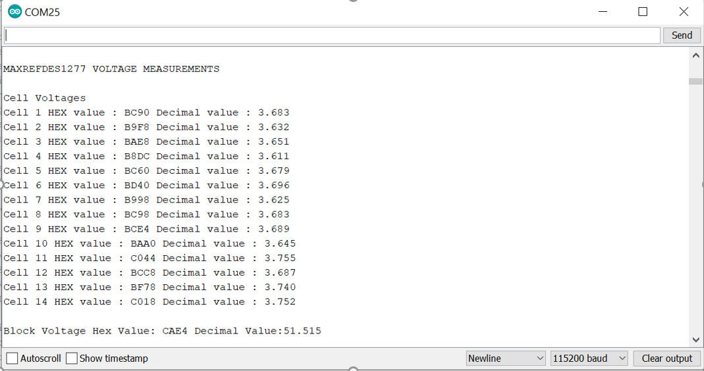

Review links, etc.

# MAXREFDES1277
The MAXREFDES1277 reference design enables quick evaluation of MAX17853/52 for battery management in a 48V system. It can be used to test IC capabilities such as measurements, cell balancing and alerts using UART and SPI communications.

### Hardware Set Up

Requirements:
- MAXREFDES1277
- MAX17841EVKIT board
- Battery test jig (Battery pack)
- General purpose micro controller (Arduino Mega 2560) for configuring and communication
- Communication cables and Jumper wire

The hardware connections for MAXREFDES1277 (MAX17852/53) with MAX17841EVKIT, battery test jig is shown in image below.

SPI wire connection details from Arduino Mega 2560 to MAX17841EVKIT

| Arduino Pin Number | MAX17841EVKIT J1 connector | Wire Color |
| --------------------------- | ------------------ | ---------- |
| 53 | CS | Orange |
| 48 | SHDN | Brown |
| 52 | SCLK | Grey |
| 51 | DIN | Purple |
| 50 | DOUT | Blue |
| 5V (in Arduino) | DCIN | Red |
| GND (in Arduino) | AGND | Black |

### Software / Firmware Flow

**Software Download/Install**

Click the "Code" button and click "Download ZIP" above (from the main GITHUB repo page). After the download finishes, unzip the archive to the directory of choice. All the files needed can be found in the firmware directory.  From the Arduino IDE, open the MAXREFDES1277.ino file. 

**Firmware Serial Output**

