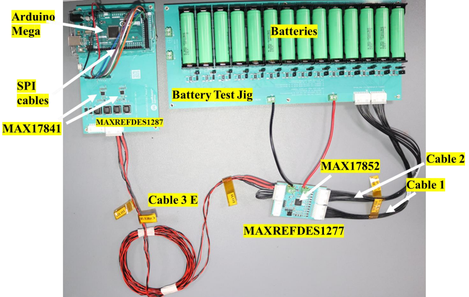
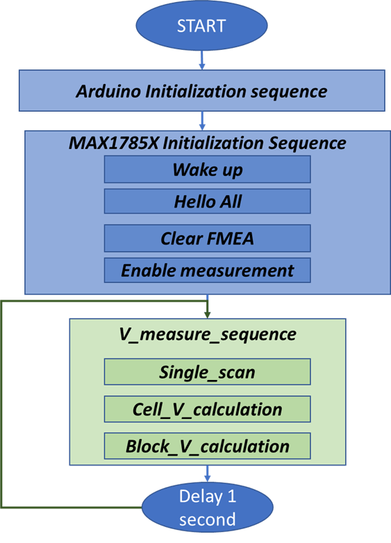

# MAXREFDES1277
The MAXREFDES1277 reference design enables quick evaluation of MAX17853/52 for battery 
management in a 48V system. It can be used to test IC capabilities such as measurements, cell balancing 
and alerts using UART and SPI communications.

The MAXREFDES1277 consists of:
- MAX17852 BMS IC
- 2 x MAX17841 for Dual UART
- MAXREFDES1277 battery test jig
- General purpose micro controller (Arduino Mega 2560) for configuring and communication
- Various Communication cables (Cable #1, #2, #3A, #3B, #3C, #3D, #3E) and Arduino Mega to 
REFDES SPI connections

### Hardware Set Up
The hardware connections for MAXREFDES1277 (MAX17852) with MAXREFDES1287 (MAX17841-
2), battery test jig and connection cables as shown in image below.

Set up of the MAXREFDES1277 involves placing battery cells into the battery test jig holders. Connecting cables cable 1 (J1 to J31), cable 2 (J2 to J32) for the voltage measurements and cable 3 (J4 to 
J24) for UART communication. The Arduino Mega 2560 microcontroller board can be connected to the computer using USB AB (printer) cable for interfacing with the computer.

Other steps and connections are as follows:
1. Connect the pins 1-2 of all the jumpers from J12 to J28 in the battery test jig. This is for the 
voltage measurements -- enabling the ADC measurements to the MAX17852. 
2. Disconnect the jumpers J41 to J54 if already connected in Battery test jig. It is for 
discharging of the battery.
3. Connect the microcontroller Arduino Mega to the MAXREFDES1287 for SPI communications. The connection details for Arduino Mega to reference design is found in the table below.

| MAXREFDES1287 J23 Connector | Arduino Pin Number | Wire Color |
| --------------------------- | ------------------ | ---------- |
| CSB_1 | 53 | Orange |
| SHDN_1 | 48 | Brown |
| SHDN_2 | 46 | Green |
| CSB_2 | 49 | White |
| SCLK | 52 | Grey |
| DIN | 51 | Purple |
| DOUT | 50 | Blue |
| +5V_MICRO | 5V (in Arduino) | Red |
| SHDNL_MICRO | NC |   |
| ALERTOUT_PIN_MICRO | NC |   |
| ALERTIN_MICRO | NC |   |
| AGND_MICRO | GND (in Arduino) | Black |

*These connections are specific to Arduino Mega 2560 microcontroller. 

For current measurements:
- Connect J33 (battery test jig) through wire to J6 (MAXREFDES1277).
- Connect J34 (battery test jig) through wire to J5 (MAXREFDES1277). For the reverse direction of the current flow, connections can be interchanged. Refer to section 2.2.2 of the [MAXREFDES1277 Reference Design Hardware User Manual](./MAXREFDES1277_Hardware_Manual.pdf) (A.K.A. User Manual) for block diagrams and hardware images.
- The UART cables are connected between J4(MAXREFDES1277) and J24
(MAXREFDES1287). See the list of the different UART cable configurations below. (Refer to section 1.3.3 of the User Manual for more details).

| Cable Designation | Description |
| ------------------| ----------- |
| Cable 3A | Single UART with external loop back |
| Cable 3B | Dual UART |
| Cable 3C | Reconfigurable Cable |
| Cable 3D | EVKIT to MAXREFDES1277 Cable |
| Cable 3E | Single UART with external loop back for 2 meters |

### Software / Firmware Flow
